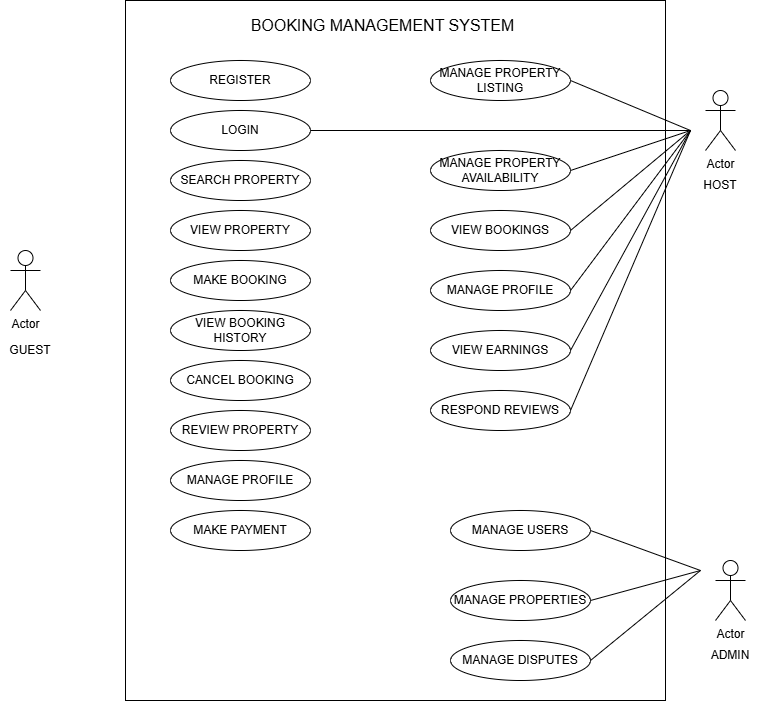

# Requirement Analysis in Software Development
This project focuses on crafting a comprehensive foundation for software development by documenting, analyzing and structuring requirements.It is detailed blueprint of the requirement analysis phase for a booking management platform.

## What is Requirement Analysis?
It is a phase in the Software Development Life Cycle (SDLC) where the team gathers, analyzes and defines the requirements of the software product to be developed. It ensures all stakeholders (clients and end-users) have a clear and mutual understanding of what the system should do and how it should perform it.

## Why is Requirement Analysis Important?
**Clarity and Understanding:** It helps in understanding what the stakeholders expect from the software.

**Scope:** It clearly defines the scope of the project thus prevents scope creep.

**Quality Assurance:** It ensures the final product meets the specified requirements thus increases customer satisfaction.

## Key Activities in Requirement Analysis
- **Requirements Gathering**

  -**Interviews:** Conducting interviews with stakeholders to gather detailed information about their needs and expectations.

  -**Surveys/Questionnaires:** Distributing surveys to collect requirements from a larger audience.

  -**Workshops:** Organizing workshops with stakeholders to discuss and gather requirements.

  -**Observation:** Observing end-users in their working environment to understand their needs.

  -**Document Analysis:** Reviewing existing documentation and systems to understand current functionalities and requirements.

- **Requirements Elicitations**

  -**Brainstorming:** Conducting brainstorming sessions to generate ideas and gather requirements.

  -**Focus Groups:** Holding focus group discussions with selected stakeholders to gather detailed requirements.

  -**Prototyping:** Creating prototypes to help stakeholders visualize the system and refine their requirements.

- **Requirements Documentation**

  -**Requirement Specification Document:** Creating a detailed document that lists all functional and non-functional requirements.

  -**User Stories:** Writing user stories to describe functionalities from the user’s perspective.

  -**Use Cases:** Creating use case diagrams to show interactions between users and the system.

- **Requirements Analysis and Modeliing**

  -**Requirement Prioritization:** Prioritizing requirements based on their importance and impact on the project.

  -**Feasibility Analysis:** Assessing the feasibility of requirements in terms of technical, financial, and time constraints.

  -**Modeling:** Creating models (e.g., data flow diagrams, entity-relationship diagrams) to visualize and analyze requirements.

- **Requirements Validation**

  -**Review and Approval:** Reviewing the documented requirements with stakeholders to ensure accuracy and completeness.

  -**Acceptance Criteria:** Defining clear acceptance criteria for each requirement to ensure they meet the expected standards.

  -**Traceability:** Establishing traceability matrices to ensure all requirements are addressed during development and testing.

  ## Types of Requirements
  ### Functional Requirements
  They describe what the system should do.

  **Examples for the Booking Management Project:**

* **Search Properties:** Users should be able to search for properties based on criteria such as location (city, neighborhood), price range (min/max), property type (apartment, house, villa), number of bedrooms, and availability dates.
* **User Registration & Login:** New users should be able to create an account by providing personal details (e.g., name, email, password) and existing users should be able to securely log in to their accounts.
* **Property Listings Management:** Property owners/admins should be able to add, edit, and remove property listings, including details like description, address, amenities, pricing, availability calendar, and high-resolution images.
* **Booking Creation:** Registered users should be able to select available dates for a property, view the total cost, and confirm a booking.
* **Booking Management:** Registered users should be able to view their upcoming and past bookings, modify (e.g., change dates, cancel) their bookings, and receive notifications regarding booking status changes.
* **Payment Processing:** The system should securely process payments for bookings, supporting various payment methods (e.g., credit card, mobile money).
* **Admin Dashboard:** Administrators should have a dashboard to manage users, properties, bookings, and review system performance.
* **Review and Rating System:** Users should be able to leave reviews and ratings for properties after their stay.

  ### Non-functional Requirements
  They describe how the system should perform.

  **Examples for the Booking Management Project:**

* **Performance:**
    * The property search results page should load within **2 seconds** for up to **500 concurrent users**.
    * Booking confirmation emails should be sent within **30 seconds** of a successful booking.
* **Security:**
    * All user login credentials and payment information must be encrypted during transmission and at rest.
    * The system must implement industry-standard security protocols (e.g., OAuth2 for authentication, HTTPS) to protect against common web vulnerabilities like SQL injection and cross-site scripting (XSS).
    * User passwords must be hashed and salted.
* **Scalability:**
    * The system architecture should be designed to support scaling horizontally to accommodate a 50% increase in user traffic and property listings within a year without significant performance degradation.
* **Usability:**
    * The booking interface should be intuitive, allowing users to complete a property booking within a maximum of **5 clicks** from the search results page.
    * The application should be accessible on major web browsers (Chrome, Firefox, Edge, Safari) and mobile devices (iOS, Android) with a responsive design.
* **Reliability:**
    * The system should maintain an uptime of **99.9%** per month.
    * In case of a system failure, the booking data should be recoverable with a Recovery Time Objective (RTO) of less than **1 hour**.
* **Maintainability:**
    * The codebase should be well-documented and follow established coding standards to facilitate future enhancements and bug fixes.

  ## Use Case Diagram
  **What are Use Case Diagrams?**
Use case diagrams are visual representations in UML (Unified Modeling Language) that show how different types of users (called **actors**) interact with a system to achieve specific goals (called **use cases**). They provide a high-level overview of the system's functionality from an external perspective, focusing on what the system does rather than how it does it.

**Benefits of Use Case Diagrams:**
* **Clear Visual Representation:** They offer an easy-to-understand visual summary of system functionalities.
* **Requirement Identification & Organization:** Help in identifying and organizing the functional requirements by showing system boundaries and user interactions.
* **Facilitate Communication:** Improve communication between stakeholders, end-users, and the development team by providing a common understanding of the system's scope and behavior.
* **Basis for Test Cases:** Can serve as a foundation for designing test cases, ensuring that all defined functionalities are covered.

**Use Case Diagram for the Booking System:**

Below is a use case diagram illustrating key interactions within the booking management system.

